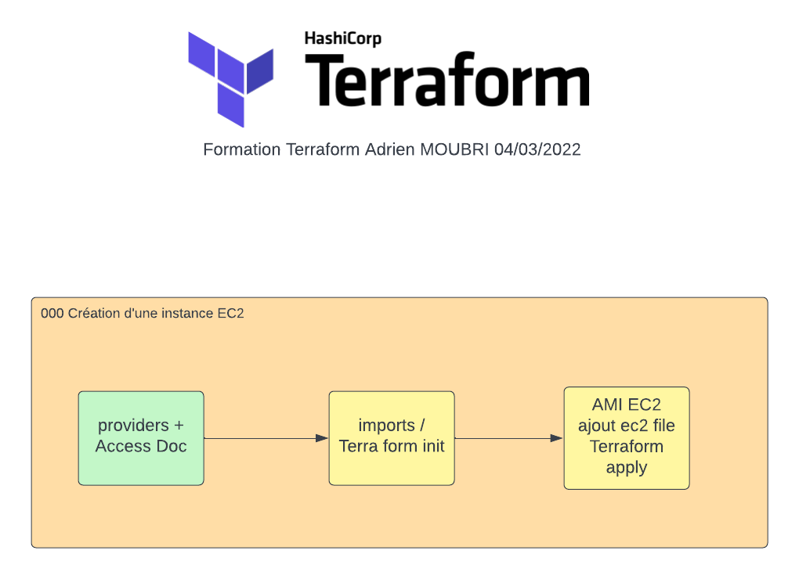
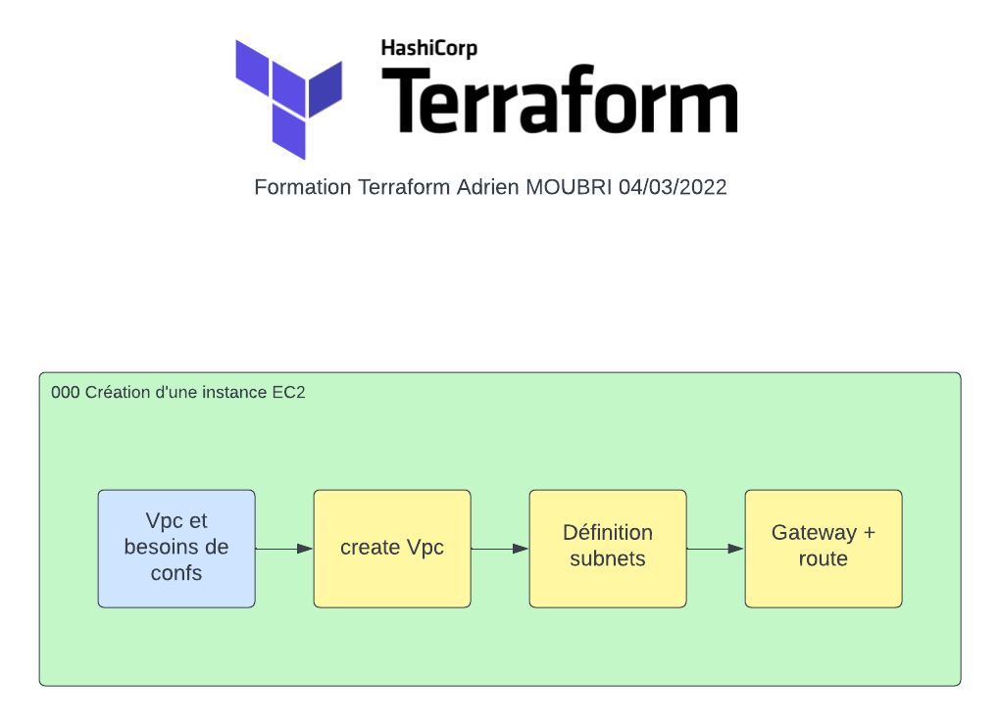

# Terraform AWS ECS tests and exercises
[]( https://www.terraform.io)

# Write, Plan, Apply
Terraform is an open-source infrastructure as code software tool that provides a consistent CLI workflow to manage hundreds of cloud services. Terraform codifies cloud APIs into declarative configuration files.


## Write
Write infrastructure as code using declarative configuration files. HashiCorp Configuration Language (HCL) allows for concise descriptions of resources using blocks, arguments, and expressions.

  
## Plan
Run terraform plan to check whether the execution plan for a configuration matches your expectations before provisioning or changing infrastructure.

## Installation
Install [Terraform](https://www.terraform.io/downloads.html).

```cmd

cd your_terraform_directory

terraform init

```

# Amazon Web Service
Install [AWS Cli V2](https://docs.aws.amazon.com/fr_fr/cli/latest/userguide/install-cliv2.html).

To use an aws account simply launch :

```bash

aws configure

```

Terraform will use your default credentials to access and create your infra.

## VsCode

To use Terraform, you will learn HashiCorp Configuration Language (HCL).

It's a good idea to have a nice IDE

You can install [Vscode](https://code.visualstudio.com/download)
You can then install the [Terraform](https://marketplace.visualstudio.com/items?itemName=HashiCorp.terraform) extension for ease of use
  

## Exercises

Once installed, you can create a new workspace.
We will use Terraform [Documentation](
https://registry.terraform.io/providers/hashicorp/aws/latest/docs)  for setting up our providers : 
and create a file named `first.tf` paste the following code inside
```
## define the source and version of our provider
terraform { 
	required_providers {
		aws = {
			source = "hashicorp/aws"
			version = "~> 3.27"
		}
	}
	required_version = ">= 0.14.9"
}
## define for the provider AWS the profile and region
provider "aws" {
	profile = "default"
	region = "eu-west-3"
}
``` 

Then launch a terminal.

```sh

terraform init #initialise the directory (download all verify providers configuration)

terraform plan #show the planned changes.
#There are no changes because there are still no ressources in this directory

terraform apply #apply the planned changes if there are any

```


### 000 : create a simple ec2

Create a new directory name `000`
Inside the `000` directory, create a file named `ec2.tf` with the configuration of the aws provider.
Open the aws console. Select the region you've configured in the provider region.
Then Go AMI Market place and find an image containing a server running on port 80. Example Nginx, Lamp,  Apache2. 
Then find the Ami Id. (Inside the browser url after the ami is selected and you clicked to the button `Launch Instance with AMI`

I will use `ami-02f89a178c735778a` it is free image of Nginx provided by Bitnami on eu-west-3. 

we will then add an EC2 resource inside the `ec2.tf` file. [EC2 resource documentation](https://registry.terraform.io/providers/hashicorp/aws/latest/docs/resources/instance)

```
resource "aws_instance"  "my_first_terraform_ec2" {
	ami = "ami-02f89a178c735778a" ## use your ami here 
	instance_type = "t2.micro" # The smallest type availlable potentially free of charge for your region 
	tags = {
		Name = "first_ec2_with_terraforms" #For EC2 we use Tags as a way to name our resource
	}
}
```
Then Launch using 
```sh
terraform init #initialise the directory (download all verify providers configuration)
terraform plan #show the planned changes.
terraform apply #apply the planned changes if there are any
```

Go back to your aws console your ec2 instance is now running. 

### 001 : create and configure vpcs

Start by creating a new directory and new file name `vpc.tf`
VPC can be tricky to configure we will follow the [Terraform VPC documentation](https://registry.terraform.io/providers/hashicorp/aws/latest/docs/resources/vpc)

Let's start by creating the VPC : 


```
resource "aws_vpc" "vpc_dev" {
  cidr_block = "10.16.0.0/16"
  tags = {
    Name = "vpc_dev"
  }
```
Find the good Ip Ranges to be able to separate the Vpc in 6 subnets (3 levels * 2 regions)
my Vpc will look like this :  

public 
external
internal

Then the Subnets turn !  <br>
each subnnet will be define as follow
```
resource "aws_subnet" "subnet_dev_public_a" {
  vpc_id            = aws_vpc.vpc_dev.id
  cidr_block        = "10.16.12.0/24"
  availability_zone = "eu-west-3a"
  tags = {
    Name = "subnet_dev_public_a"
  }
}
```
create each subnet then let's configure the gateway on for each vpc you create
 
```
resource "aws_internet_gateway" "gatway_dev" {
  vpc_id = aws_vpc.vpc_dev.id
  tags = {
    Name = "gatway_dev"
  }
}
```


then the routes. One for each Gateway. (We are gonna use the default route table here)
```
resource "aws_route" "route-dev-public" {
  route_table_id              = aws_vpc.vpc_dev.default_route_table_id
  destination_ipv6_cidr_block = "::/0"
  destination_cidr_block      = "0.0.0.0/0"
  gateway_id                  = aws_internet_gateway.gatway_dev.id
}
```

We can add the following code to be notfied of the vpc ids once they are created : 
```
output "vpc_ids" {
  value = {
    dev = aws_vpc.vpc_dev.id
    # add other infos you want here 
    # rec = aws_vpc.vpc_rec.id
  }
  description = "created vpcs ids"
  sensitive = false
}

```
then Enjoy !!
```sh
terraform init #initialise the directory (download all verify providers configuration)
terraform plan #show the planned changes.
terraform apply 
```

### 010 : create an ec2 inside a vpc

create directory `010`
create file `var_dev.tfvars`
```
## vpc dev
vpc_id = "YOUR_VPC_ID"
vpc_name = "dev"
ami_ec2 = "ami-0f3ad5207958726df" #Your AMI Id
```
create var file for each vpc you created here i use it for my separation of each environment

create `ec2.tf` file 

add provider 

then add our varibles so terraform can find them !  
```
variable "vpc_id" {
  type = string
}

variable "vpc_name" {
  type = string
}

variable "ami_ec2" {
  type = string
}

```
data can be used to find more info about an existing state : 
here we are gonna extract the subnets of an vpc.
```
data "aws_vpc" "vpc" {
  id = var.vpc_id
}

data "aws_subnet_ids" "external_subnets" {
  vpc_id = var.vpc_id
  tags = {
      Name = "*external*" #Filter of all subnet vpc by their tagName conatining external
  }
}
```

Then configure the EC2 : 

```
resource "aws_instance" "ec2_external" {
  ami           = var.ami_ec2 #usage of variable for the ami
  instance_type = "t2.micro" #we could have put a variable here also so the dev and rec could have a diffrent instance type
  for_each = toset(data.aws_subnet_ids.external_subnets.ids) #creation of instance for each subnet we found
  subnet_id     = each.value
  tags = {
    Name= "ec2_${var.vpc_name}_external"  #Concatenation of variable inside the name of our instance so we can find it later 
  }
}

```


```
terraform init
terraform plan -var-file var_dev.tfvars  #we add the variable file for environment definition
terraform apply -var-file var_dev.tfvars 
```

once created and working don't forget to terraform destroy
  
  

### 011 : ALBS !! 
copy 010 directory as 011

create a new file alb.tf
lot of things to do !
what we want to do is to add an alb on the public subnets like we did with the internal one

add the datas list the public subnets

I) create the Alb 
```
resource "aws_lb" "alb_ec2" {
  name               = "alb-${var.env}-${var.appname}-ec2"
  internal           = false
  load_balancer_type = "application"
  security_groups    = [aws_security_group.sg_alb.id]
  subnets            = toset(data.aws_subnet_ids.subnets_public.ids)

  tags = {
    Name = "alb_${var.env}_${var.appname}_ec2"
  }
}
```

II)  create Target Groups 
a) target group
```
resource "aws_lb_target_group" "alb_tgroup_ec2" {
  name     = "tg-${var.env}-${var.appname}-ec2"
  port     = 80
  protocol = "HTTP"
  vpc_id   = var.vpc_id
}

```
b) attach target group to ec2
```
resource "aws_lb_target_group_attachment" "alb_tg_attach_ec2" {
  depends_on        = [aws_lb_target_group.alb_tgroup_ec2]
  target_group_arn  = aws_lb_target_group.alb_tgroup_ec2.arn
  for_each          = aws_instance.ec2_external
  target_id         = each.value.id
  port              = 80
}
```


III) Security Groups
a)create a security group as follow for the Alb and one for the Ec2
```
resource "aws_security_group" "sg_alb" {
  name          = "sg_${var.env}_${var.appname}_alb"
  vpc_id = data.aws_vpc.vpc.id
  description   = "Security group for ALB test Terraforms"
  tags = {
    Name        = "sg_${var.env}_${var.appname}_alb"
  }
}
```
1) ALB ingress port 80
```
resource "aws_security_group_rule" "sgrule__httpalb" {
  type                      = "ingress"
  from_port                 = 80
  to_port                   = 80
  protocol                  = "TCP"
  cidr_blocks               = ["0.0.0.0/0"]
  security_group_id         = aws_security_group.sg_alb.id
}
```
2) Alb Egress
same thing for Egress
```
resource "aws_security_group_rule" "sgrule_alb_egress_httpalb" {
  type                      = "egress"
  from_port                 = 80
  to_port                   = 80
  protocol                  = "TCP"
  security_group_id         = aws_security_group.sg_alb.id
  cidr_blocks               = [data.aws_vpc.vpc.cidr_block]
}

```

Take a step back and `terraform apply`. 
You can alway test your setup and assure yourself that what you are building correspong to your design with the aws console.

b) Ec2 
now create an security group for the ec2

don't forget Ingress rules for port 80.


apply and destroy !

### 100 : RDS
copy `011` directory as `100` directory

Here we want to create our db in the safest subnets the `private` one 

so add in the datas list the private subnets like we did with the internal and the external

For Rds we need to define an [db_subnet_goup](https://registry.terraform.io/providers/hashicorp/aws/latest/docs/resources/db_subnet_group) : 
in [Rds](https://registry.terraform.io/providers/hashicorp/aws/latest/docs/resources/db_instance) we will use Mysql 8.0 as it is a free tier eligable type.


I) Create RDS
a) define Rds Password in the var file
```
db_password = "helloWorld"
```

b) create a file `rds.tf`
add the variable db_password. Here we will also add the sensitive option. 

```
variable "db_password" {
  description = "RDS root user password"
  type        = string
  sensitive   = true #this will assure terraform don't save this variable in a file
}
```
c) vpc subnet Groups
go to the vpc.tf file and add
```
resource "aws_db_subnet_group" "subnetgroup_internal_rds" {
  name       = "main"
  subnet_ids = toset(data.aws_subnet_ids.subnets_internal.ids)
  tags = {
    Name = "MySql Dev db subnetGroup"
  }
}

```

II) security Groups

1) Sg RDS
```
resource "aws_security_group" "sg_rds" {
  name          = "sg_${var.env}_${var.appname}_rds"
  vpc_id = data.aws_vpc.vpc.id
  description   = "Security group for RDS test Terraforms"
  tags = {
    Name        = "sg_${var.env}_${var.appname}_rds"
  }
}
```

Ingress rule allow EC2 access to our RDS Mysql instance
```
resource "aws_security_group_rule" "sgrule_mysql_rds" {
  type                      = "ingress"
  from_port                 = 3306
  to_port                   = 3306
  protocol                  = "TCP"
  source_security_group_id  = aws_security_group.sg_ec2.id
  security_group_id         = aws_security_group.sg_rds.id
}
```

2) Rds config
go back to rds.tf

and then add our Rds config 
```
resource "aws_db_instance" "rds_internal" {
  identifier             = "rds-${var.env}-internal-${var.appname}"
  instance_class         = "db.t3.micro"
  allocated_storage      = 5
  engine                 = "mysql"
  engine_version         = "8.0"
  username               = "admin"
  password               = var.db_password
  db_subnet_group_name   = aws_db_subnet_group.subnetgroup_internal_rds.name
  vpc_security_group_ids = [aws_security_group.sg_rds.id]
  publicly_accessible    = false
  skip_final_snapshot    = true
  tags = {
    Name= "rds_${var.env}_internal_${var.appname}"
  }
}
```

terraform init
terraform apply -var-file var_dev.tfvars

# Going Further

## Saving infra state using [Terraforms Backends](https://www.terraform.io/language/settings/backends)
Backends primarily determine where Terraform stores its [state](https://www.terraform.io/language/state). Terraform uses this persisted [state](https://www.terraform.io/language/state) data to keep track of the resources it manages. Since it needs the state in order to know which real-world infrastructure objects correspond to the resources in a configuration, everyone working with a given collection of infrastructure resources must be able to access the same state data.
###  S3 
Stores the state as a given key in a given bucket on [Amazon S3](https://aws.amazon.com/s3/).
Example Configuration

```hcl
terraform {  
	backend "s3" {    
	bucket = "mybucket"    
	key    = "path/to/my/key"    
	region = "eu-west-3"  
	}
}
```
## Using [ECS](https://aws.amazon.com/fr/ecs/) to host Docker Image
  [](https://aws.amazon.com/fr/ecs/?whats-new-cards.sort-by=item.additionalFields.postDateTime&whats-new-cards.sort-order=desc&ecs-blogs.sort-by=item.additionalFields.createdDate&ecs-blogs.sort-order=desc)

Amazon Elastic Container Service (Amazon ECS) is a fully managed container orchestration service that helps you easily deploy, manage, and scale containerized applications. It deeply integrates with the rest of the AWS platform to provide a secure and easy-to-use solution for running container workloads in the cloud and now on your infrastructure with Amazon ECS Anywhere.


